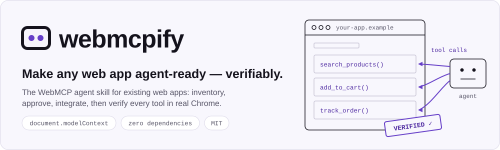
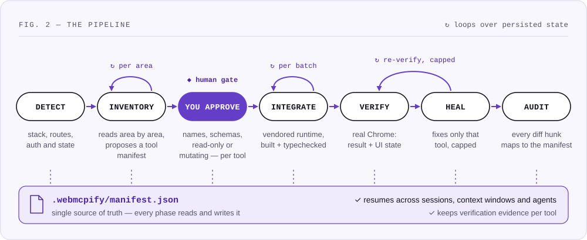
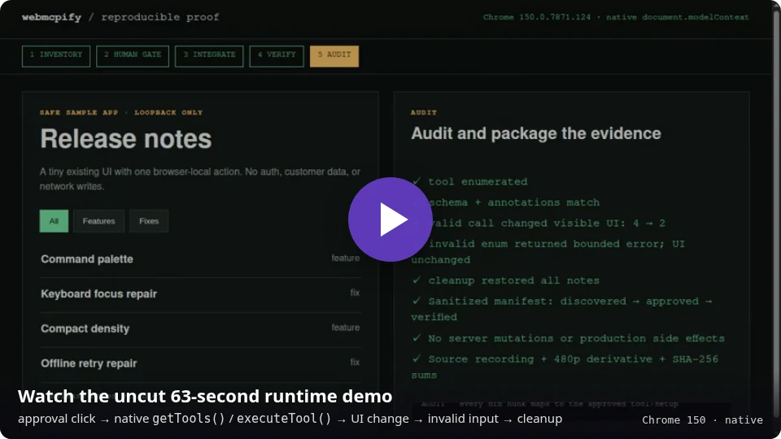

<h1 align="center">webmcpify — the WebMCP agent skill</h1>

<p align="center">
  <picture>
    <source media="(prefers-color-scheme: dark)" srcset="assets/readme/banner-dark.svg">
    
  </picture>
</p>

<p align="center">
  <a href="https://github.com/TueJon/webmcpify/releases/latest"></a>
  <a href="https://github.com/TueJon/webmcpify/actions/workflows/ci.yml"></a>
  <a href="LICENSE"></a>
  <a href="https://webmachinelearning.github.io/webmcp/"></a>
</p>

<p align="center">
  <a href="https://webmcpify.at"><b>Website</b></a> ·
  <a href="https://webmcpify.at/docs/"><b>Docs</b></a> ·
  <a href="#install">Install</a> ·
  <a href="#see-it-run">Demo</a> ·
  <a href="CHANGELOG.md">Changelog</a>
</p>

**webmcpify** is an agent skill that makes an **existing** web app callable by browser
AI agents through [WebMCP](https://webmachinelearning.github.io/webmcp/) —
`document.modelContext`, the proposed standard incubated in the W3C Web Machine
Learning Community Group and in Chrome origin trial. Your coding agent inventories
the app, proposes a tool manifest for your approval, integrates the tools with a
tiny vendored runtime, and **proves each one works in real Chrome**. Unrelated code
stays untouched — from a static landing page to a multi-tenant SaaS.

```sh
npx skills add TueJon/webmcpify     # once
/webmcpify                          # in your app's repo, inside your coding agent
```

> [!TIP]
> **New in [v0.6.0](https://github.com/TueJon/webmcpify/releases/tag/v0.6.0):**
> evidence-aware resume — changed app files, contracts or browsers invalidate the
> verification they affect — plus scoped browser access and independent checks for
> every mutation.

## How it works

<p align="center">
  <picture>
    <source media="(prefers-color-scheme: dark)" srcset="assets/readme/pipeline-dark.svg">
    
  </picture>
</p>

- **One human checkpoint.** You approve the tool manifest: names, schemas, examples,
  coverage reasons, and a read-only or mutating class per tool. After that the agent
  only comes back for what it genuinely can't resolve — an app that won't start, or a
  tool that still fails after its capped heal attempts.
- **Loops over persisted state.** Every phase reads and writes
  `.webmcpify/manifest.json`, so a run resumes across sessions, context windows and
  even different agents. Recorded evidence tells it which checks are still valid.
- **Proof, not promises.** Each tool is enumerated and executed through Chrome's
  native `getTools()` / `executeTool()`, asserting on the tool result **and** the
  resulting UI state.

## What your agent adds to your app

From the [reproducible proof fixture](proof/README.md). First, the manifest entry
you approve at the gate (abridged):

```jsonc
{
  "id": "set_release_filter",
  "mutating": "client",                        // browser state only — no server write
  "inputSchema": {
    "type": "object",
    "properties": { "category": { "type": "string", "enum": ["all", "feature", "fix"] } },
    "required": ["category"],
    "additionalProperties": false
  },
  "source": ["proof/demo/app.js:applyFilter"],  // the UI's existing code path
  "examples": { "valid": { "category": "fix" }, "invalid": { "category": "private" } },
  "expect": { "result": "2 release notes visible",
              "ui": "only the two synthetic fix notes remain visible" },
  "cleanup": "execute the same UI path with category=all"
}
```

Then the integration: a registration that calls the code path the UI already uses,
through the vendored runtime.

```js
import { createToolScope } from './webmcpify.js';  // vendored, MIT, ~290 lines
import { applyFilter } from './app.js';           // existing UI logic, unchanged

createToolScope('proof-release-notes', [{
  name: 'set_release_filter',
  description: 'Filters the visible synthetic release notes by category '
    + "using the page's existing filter path.",
  inputSchema: schema,                             // the approved schema above
  annotations: { readOnlyHint: false, untrustedContentHint: false, consequentialHint: false },
  execute: ({ category }) => {
    if (!schema.properties.category.enum.includes(category)) {
      return 'ERROR: category must be one of all, feature, or fix.';
    }
    return `${applyFilter(category)} release notes visible for ${category}.`;
  },
}]);  // feature-detected: a safe no-op in browsers without WebMCP
```

## See it run

<p align="center">
  <a href="proof/artifacts/webmcpify-proof-480p.mp4"></a>
</p>

A prepared local fixture passes a real approval click, registers one client-only tool,
then exercises native `document.modelContext.getTools()` / `executeTool()`, a visible
UI change, invalid-input handling and cleanup. The runtime registration and browser
assertions are real; the phase labels are advanced by a script for legibility, so the
recording does not run the skill's inventory, integration or audit phases. Reproduce
the native checks with `npm run proof:verify`; the [`proof/`](proof/README.md) pack
holds the fixture, before/after manifests, an illustrative patch and checksums.

## Install

| Where | How |
|---|---|
| **Any agent** — Claude Code, Codex, Cursor, opencode, Copilot and [70+ more](https://github.com/vercel-labs/skills) | `npx skills add TueJon/webmcpify` |
| **Claude Code** plugin | `/plugin marketplace add TueJon/webmcpify` then `/plugin install webmcpify@webmcpify` |
| **Manual** | Copy [`skills/webmcpify/`](skills/webmcpify/) into your agent's skills directory, or tell your agent to follow [`SKILL.md`](skills/webmcpify/SKILL.md) |

The skill directory is self-contained: pipeline, phase guides, vendorable runtime and
the verification template all ship inside it.

## Use

Open your agent in the target repo and pick a scope — or just say *"webmcpify this app"*.

| Command | What happens | Changes your code |
|---|---|---|
| `/webmcpify` | Full pipeline, resuming wherever the manifest says | After your approval |
| `/webmcpify inventory` | Investigate and propose the tool manifest | Never |
| `/webmcpify integrate` | Integrate the approved manifest in small batches | Yes |
| `/webmcpify workbench` | Agent launches a temporary visual tool inspector | No — development aid only |
| `/webmcpify verify` | Verify and heal what is integrated | Only to fix a failing tool |
| `/webmcpify status` | Where are we, what's next | Never (read-only) |
| `/webmcpify full parity` | Census every interactive element on every authenticated route | After your approval |

### Curated core or route-by-route parity

| | **Curated** | **Parity** |
|---|---|---|
| Goal | A usable toolset for the actions that matter | Auditable completeness |
| Output | Reviewed route → tool map for core actions | Per-route element census: every interaction maps to a tool or a written reason |
| Keeps it usable by | Priority waves, an overlap rule (no two tools match the same request), role/tenant coverage | Route-scoped registration; client-capacity gaps are reported, never guessed |

The agent asks you to choose before inventory — there is no silent default — and a
tool count alone is never called 100%.

## Guarantees

| | Guarantee | How it's enforced |
|---|---|---|
| 🧩 | **Unrelated code stays untouched** | Every diff hunk traces to a manifest entry; a final audit checks against the recorded baseline commit; files already dirty at the start are never modified or reverted |
| 🔒 | **Read-only first** | Server mutations need your explicit per-tool approval; auth, signup, billing, payment and credential-returning tools stay excluded; irreversible deletes can only open the app's own confirmation UI |
| 🛡️ | **Your server stays the trust boundary** | Tools only call code paths your UI already uses — no new endpoints, no bypasses |
| 📦 | **Zero dependencies** | A small MIT runtime is vendored and feature-detected; the app behaves the same in browsers without WebMCP |
| 🧪 | **Exercised, not assumed** | Every tool runs in real Chrome against the result and the UI state; mutations are confirmed through an independent read path with an unchanged neighbor; declarative forms get the real submit click |
| ♻️ | **Honest resume** | Changed files, contracts, runtimes or browsers invalidate the evidence they affect, unknown dependencies mean a full re-check, and interrupted mutations are reconciled before any retry ([re-verification](skills/webmcpify/references/reverify.md)) |
| 🔐 | **Scoped access** | A dedicated test context with approved origins, accounts and fixtures; official guidance is read directly, never executed as an unreviewed package |
| 🧭 | **Spec over scoreboard** | Checker findings are classified, not chased; the public discovery layer (`/.well-known/webmcp`) is a separate approval |

<details>
<summary><b>Built to scale to large codebases</b></summary>

- **Inventory** maps the codebase into areas (routes, views, modules) first, then
  deep-reads one area per iteration — a 500-file SaaS is processed area by area,
  never in one context-busting sweep. Sub-agent fan-out writes per-area shard files;
  a single coordinator merges them.
- **Integrate** works in batches of one area or at most five tools, each built and
  typechecked — committed per batch only if you opted in.
- **Verify / Heal** iterate per tool with attempt caps and honest escalation;
  mutating tools get cleanup steps between retries.
- **Interrupt anywhere.** The next run resumes from the manifest; `status` stays
  read-only.

</details>

<details>
<summary><b>Platform status and compatibility</b></summary>

WebMCP is an **origin trial** (Chrome 149 onward; the stable milestone is an
estimate, not a commitment). Production exposure needs an
[origin-trial token](https://developer.chrome.com/origintrials/); local development
needs `chrome://flags/#enable-webmcp-testing`. The API has already changed during
the trial (testing API removed 2026-07; `navigator` → `document`) — webmcpify
isolates that churn in one vendored file, and its verification probes whether the
browser takes current object input or Chrome 150's legacy JSON-string input without
retrying real tools. Integration reads the official Chrome guides and the CG draft
directly.

ChatGPT's separate, model- and account-gated client surface is documented as
[Site tools](skills/webmcpify/references/client.md), with dated availability facts
and a troubleshooting order. Release-by-release spec adaptations are in the
[changelog](CHANGELOG.md).

</details>

## What's in this repo

| Path | Purpose |
|---|---|
| [`skills/webmcpify/SKILL.md`](skills/webmcpify/SKILL.md) | The pipeline your agent follows |
| [`skills/webmcpify/references/`](skills/webmcpify/references/) | Phase guides: inventory, integrate, Workbench, runtime, verify, re-verify, heal, security, discovery, client surfaces |
| [`skills/webmcpify/templates/`](skills/webmcpify/templates/) | Vendorable runtime (TS + JS), temporary visual Workbench, ambient types, Playwright verification template, discovery manifest |
| [`proof/`](proof/README.md) | Reproducible native-Chrome proof: fixture, manifests, recording, checksums |

## Related projects

- [webmcpify.at](https://webmcpify.at) — the project website, itself agent-ready in all three layers: imperative tools via the vendored runtime, a declarative install form, and a published `/.well-known/webmcp` manifest
- [webmachinelearning/webmcp](https://github.com/webmachinelearning/webmcp) — the spec draft (W3C WebML CG)
- [GoogleChromeLabs/webmcp-tools](https://github.com/GoogleChromeLabs/webmcp-tools) — Google's demos, types and evals CLI (webmcpify follows these patterns)
- [GoogleChrome/modern-web-guidance](https://github.com/GoogleChrome/modern-web-guidance) — official best-practice guides (optional CLI; exact version and execution approval required)
- [Puppeteer WebMCP](https://pptr.dev/guides/webmcp) — experimental first-class WebMCP automation API (Chrome 151+ as documented 2026-08-29; alternative verify harness)
- [MCP-B / WebMCP-org](https://github.com/WebMCP-org/npm-packages) — polyfill, extension, transports and dev tooling (webmcpify vendors a minimal runtime instead of adding dependencies)

## License

[MIT](LICENSE) — © Jonas Tüchler
